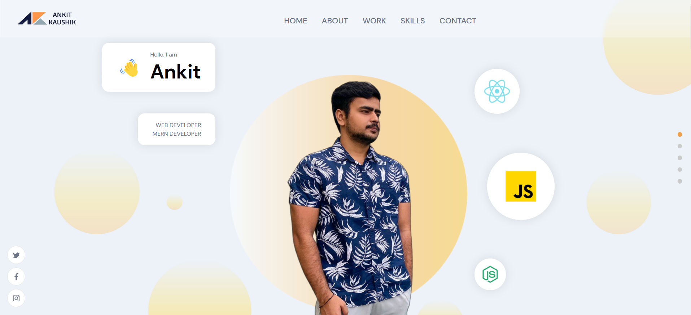

# AnkitKaushik - Personal Protfolio

I used tools like React, Motion Framer, Sanity, SCSS, and others to create this portfolio Web App. I created all of the styles with the aid of SCSS, and to make it even more impressive, I used sanity, which allows me to update and change the database as often as I need to. 

Website Link - https://ankit-kaushik.web.app/

Developed by Ankit Kaushik! Enjoy! :D